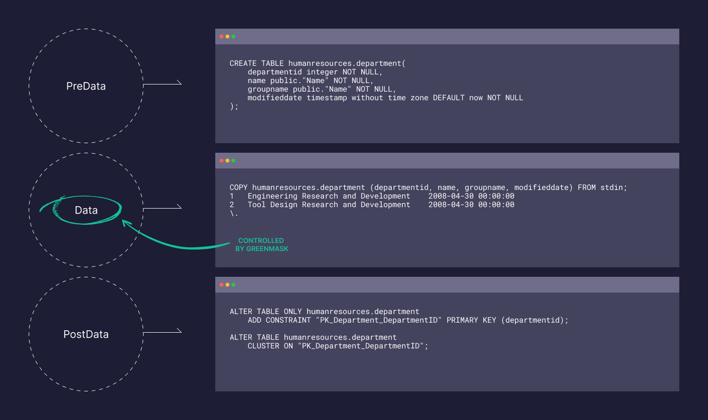

As discussed in [database anonymization: the basics](/blog/greenmask-database-anonymization-security), the process is inherently complex and can typically be approached in two ways—or even by combining them: anonymization and synthetic data generation. To achieve these, we need a tool equipped with essential features such as data transformation, database schema dumping, and database subsetting. In this article, we will explore some key features of Greenmask and highlight the use cases where they can be effectively applied.

{/* truncate */}

[**Greenmask**](https://github.com/GreenmaskIO/greenmask) is an open-source core utility designed as an extensible tool built on top of vendor-specific dump utilities, such as pg_dump for PostgreSQL. One of the primary goals set by the Greenmask engineering team is to maintain reliability comparable to that of vendor utilities. Instead of independently generating database schema dumps (e.g., CREATE TABLE statements), Greenmask delegates this task to the vendor utilities. This approach avoids the challenges of maintaining compatibility with all major database versions, whether it's MySQL, PostgreSQL, or others.

Consider a scenario where a major database release introduces changes in table definition syntax. Maintaining support for such changes would require continuous updates. However, by leveraging vendor utilities—which are inherently reliable for schema dumping—Greenmask can focus exclusively on data dumping and anonymization, ensuring it delivers the best possible results in this area while delegating schema dumping to the vendor utility.

Greenmask is extensible and offers a variety of features, but there are a few key ones we want to highlight.

## Database subset

Greenmask allows you to define subset conditions for filtering data during the dump process. This feature is particularly useful when you need to extract only a specific part of the database, such as a single table or a group of tables. It automatically ensures data consistency by including all related data from other tables necessary to maintain the integrity of the subset. Greenmask is also capable of handling circular references in database schemas, even in complex cases where multiple cycles exist within a strongly connected component.

## Deterministic transformers

These use hash functions to ensure consistent output for the same input, providing reliability and repeatability. Most transformers support both random and hash-based engines, offering flexibility to suit a wide range of use cases.

## Dynamic parameters

Most transformers support dynamic parameters, enabling them to adapt based on table column values. This feature is particularly useful for managing dependencies between columns and ensuring constraints are handled effectively.

## Transformation validation and easy maintenance

Greenmask provides validation warnings, data transformation diffs, and schema diffs during configuration, enabling effective monitoring and maintenance of transformations. The schema diff feature is particularly useful for preventing data leakage when the schema changes. We understand that software and data do not exist in a vacuum—they continuously evolve throughout the software lifecycle. To address this, Greenmask is not just a tool but a comprehensive process that allows you to validate and review changes before applying them in untrusted or testing environments.

## Transformation inheritance

Greenmask supports transformation inheritance for partitioned tables and tables with foreign keys. You can define a transformation once and apply it to all related tables that reference it. If your tables do not have foreign keys, you can define virtual ones to achieve the same functionality.

## Database type safe

Greenmask ensures data integrity by validating data and utilizing the database driver for encoding and decoding operations, preserving accurate data formats. If you've ever used services or utilities that make changes without validation—only to encounter errors during restoration, such as a timestamp being mistakenly inserted into an integer field—Greenmask eliminates such issues. It operates with transformers that use the database driver to encode and decode data, ensuring reliable, on-the-fly transformations.

## Conclusion

There are many additional features that can be applied to various use cases. You can explore them in detail in our [comprehensive documentation](https://docs.greenmask.io/latest/). Greenmask is an excellent choice if you're looking for a unified tool that not only covers nearly every technical aspect but also provides a clear process for maintaining database anonymization and generating synthetic data. Don't hesitate to test your innovative ideas using our [playground](https://docs.greenmask.io/latest/playground/), which can be easily deployed locally with Docker Compose.
