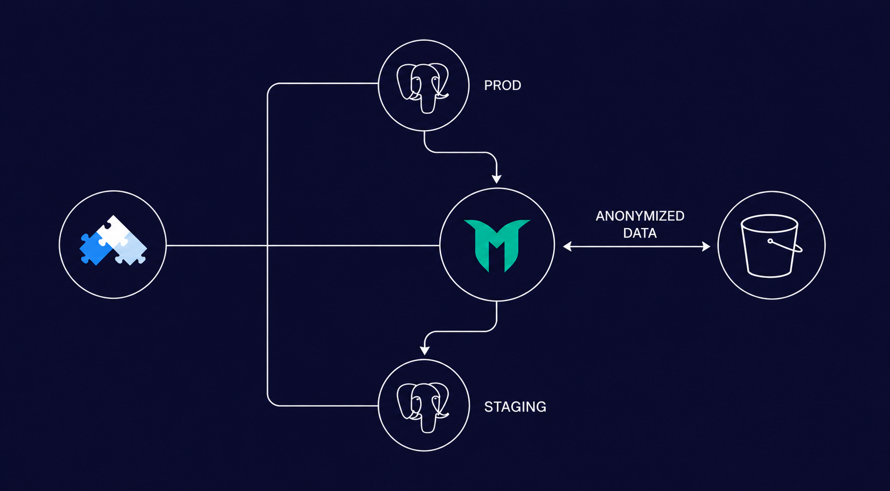

## Introduction

This article shows how **Greenmask** and **OpenEverest** can be combined to build a **cloud-native Test Data Management (TDM) workflow**. Greenmask anonymizes production database dumps, while OpenEverest automates provisioning and lifecycle management of database clusters on Kubernetes. Together they enable teams to quickly spin up **staging environments populated with safe, production-like data**. This approach helps developers validate integrations faster while maintaining **data privacy and compliance**.

{/* truncate */}

## Greenmask's Core Mission

The core idea behind **Greenmask** from the very beginning has been to provide users with a convenient way to create test data for development and testing environments.

While the Greenmask CLI utility performs this task extremely well and provides a wide range of functionality — enabling teams to implement different approaches to **Test Data Management (TDM)** — much of the surrounding automation has traditionally remained the responsibility of the user. Tasks such as scheduling jobs, regularly taking dumps, delivering and configuring staging datasets, performing semantic analysis of data, and maintaining transformation configurations were typically handled by the teams adopting the tool.

## Expanding Greenmask into a Platform

Over the past year, the Greenmask team has focused on improving the platform's extensibility. This effort resulted in [a new internal framework and MySQL support](https://github.com/GreenmaskIO/greenmask/releases/tag/v1.0.0b1), introduced as part of the services layer. The goal of v1 is to provide a versatile foundation that simplifies adding support for new DBMSs and extending Greenmask with new features.

This step allowed us to move further toward building a broader platform around Greenmask.

Our goal is to address **Dynamic Staging Environment** capabilities — making it easier to provision realistic testing environments with production-like data. That is why we started building a cloud-native, API-first Greenmask platform.

At the same time, the Greenmask CLI will remain fully available, allowing users to continue using it as a standalone tool or as part of the larger platform.

## Why OpenEverest Is a Natural Fit

Provisioning databases and managing them throughout their lifecycle is a complex challenge. This is exactly the problem the [**OpenEverest**](https://openeverest.io/) team has been solving. OpenEverest is the first open-source platform for automated database provisioning and lifecycle management. It supports multiple database technologies and can be deployed on any Kubernetes infrastructure — whether in the cloud or on-premises.

[OpenEverest is evolving toward a **modular architecture**](https://vision.openeverest.io/), where databases, storage systems, and other technologies are implemented as plugins. In the near future, we expect to see support for technologies such as **ClickHouse, Vitess, DocumentDB, Valkey**, along with integrations with Prometheus and other ecosystem tools.

## Toward a Seamless TDM Integration

Because of this strong alignment, **we are starting work on a Test Data Management solution** that integrates seamlessly with the OpenEverest ecosystem. Our goal is to make Greenmask a first-class provisioning method inside OpenEverest, allowing teams to spin up staging databases populated with anonymized, production-like data as easily as selecting an option during cluster creation.

At the same time, we want to deliver value to users today. That's why we prepared a collaborative blog post with **Sergey Pronin (founder of** [**Solanica.io**](https://solanica.io/)**)**:

👉 [**Anonymizing Data with Greenmask and OpenEverest**](https://openeverest.io/blog/greenmask-data-anonymization/)

## How the Greenmask and OpenEverest Flow Works

OpenEverest manages production and staging databases, while Greenmask anonymizes production data to safely populate staging environments.

The article demonstrates how Greenmask can already be used to implement Test Data Management workflows within the OpenEverest ecosystem.

## Why TDM Matters for AI-Driven Development

In our view, Test Data Management capabilities are becoming increasingly important in the context of the rapidly growing adoption of AI in software development. The faster a developer — or an AI agent — can spin up a complete test environment composed of multiple services and databases, and roll it back when needed, the faster hypotheses and integrations can be validated.

**Accelerating validation directly accelerates development.** Automated, safe access to realistic datasets will become a critical component of this workflow.

## A Step Toward Dynamic Staging Environments

This collaboration demonstrates how combining **database lifecycle automation** with **data anonymization and transformation** enables teams to safely work with realistic production data in development environments.

We believe that integrating Greenmask with OpenEverest is a natural step toward building a fully automated and secure **Dynamic Staging Environment (DSE) workflow for modern cloud-native infrastructure**.
